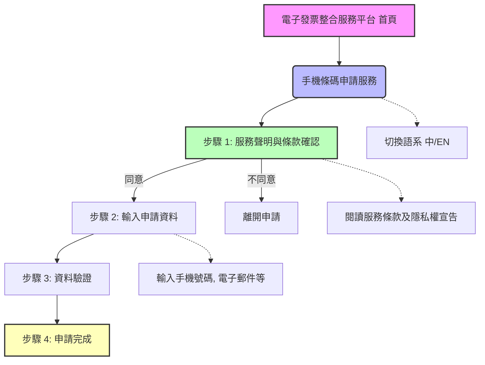

# 電子發票整合服務平台 - 手機條碼申請流程 Sitemap

```mermaid
graph TD
    A[電子發票整合服務平台 首頁] --> B(手機條碼申請服務)
    B --> C[步驟 1: 服務聲明與條款確認]
    C -->|同意| D[步驟 2: 輸入申請資料]
    C -->|不同意| E[離開申請]
    D --> F[步驟 3: 資料驗證]
    F --> G[步驟 4: 申請完成]
    
    B -.-> H[切換語系 中/EN]
    C -.-> I[閱讀服務條款及隱私權宣告]
    D -.-> J[輸入手機號碼, 電子郵件等]
    
    style A fill:#f9f,stroke:#333,stroke-width:2px
    style B fill:#bbf,stroke:#333,stroke-width:2px
    style C fill:#bfb,stroke:#333,stroke-width:2px
    style G fill:#ffb,stroke:#333,stroke-width:2px
```
